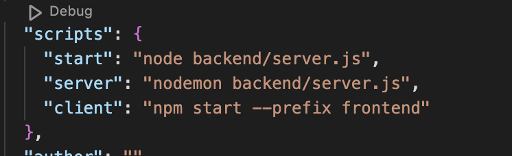
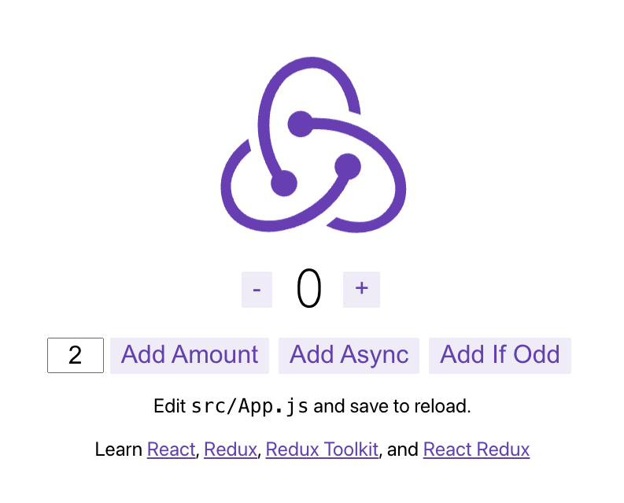

# Goal Setting App to learn the MERN Stack

* Mongo
* Express
* React
* Node JS

## Packages
* express (Backend Node.js Framework)
* dotenv (Protect hidden environments)
* mongoose (ODM library for MongoDB and Node.js - manage relationships between data)
* colors (view colours in error handling)
* nodemon (automatic server restart)
* express-async-handler (error handling)

Note: ODM = Object Data Modelling

## Project Overview
To learn the MERN stack through practice. This project is to build from start to finish a Goal Setting applicaton.
Making use of CRUD operations.

## To run server
package.json was updated

```
{
    scripts: 
    {
        "start": "node backend/server.js",
        "server": nodemon backend/server.js"
    }
}

npm start server

```


## Authentication
To create Register user functionality, the data needs to be encrypted.

Install Bcrypt:

``npm i bcryptjs``

Install JSON Web Tokens:

``npm i jsonwebtoken``

## Redux - Frontend

1. Install redux, the below is for latest, with a template and installing redux.

``npx create-react-app@latest frontend --template redux``


2. Update the backend package.json script to prefix the frontend redux app. 

`` "client": "npm start --prefix frontend"``



3. To run the frontend app:

``npm run client``

Example of Redux



4. 


## Resources
Traversy Media:

Part 1: https://www.youtube.com/watch?v=-0exw-9YJBo

Learn The MERN Stack - JWT Authentication

Part 2: https://www.youtube.com/watch?v=-0exw-9YJBo

Learn the MERN Stack - Frontend Authentication | Redux Toolkit

Part 3: https://www.youtube.com/watch?v=mvfsC66xqj0

Git Repository: https://github.com/bradtraversy/mern-tutorial


## Important Websites

JWT: https://jwt.io/

Redux: https://redux-toolkit.js.org/

Redux DevTools (Chrome Extension): https://chrome.google.com/webstore/detail/redux-devtools/lmhkpmbekcpmknklioeibfkpmmfibljd?hl=en

Note of interest: https://github.com/pmndrs/zustand
